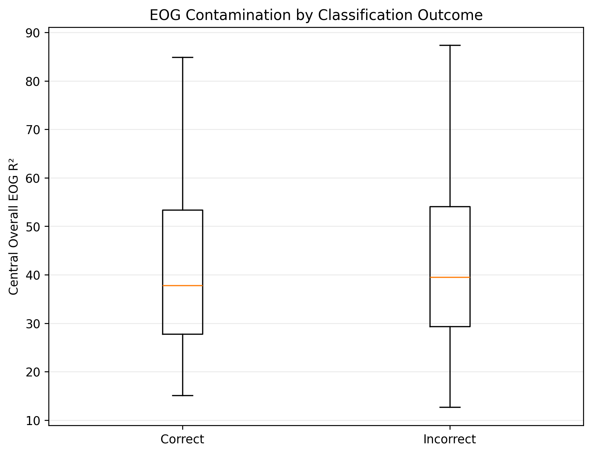
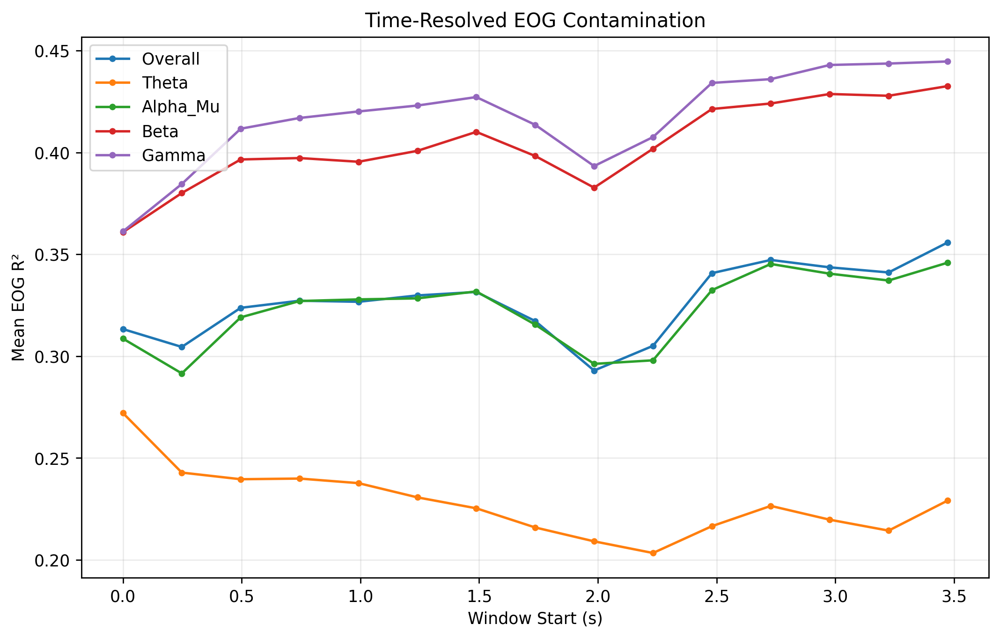
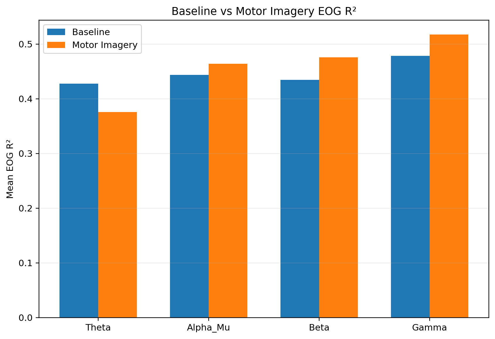
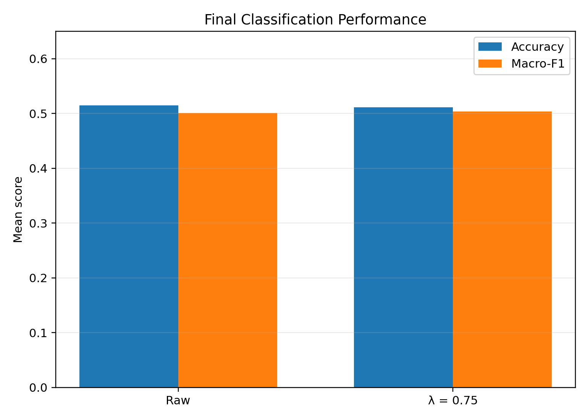
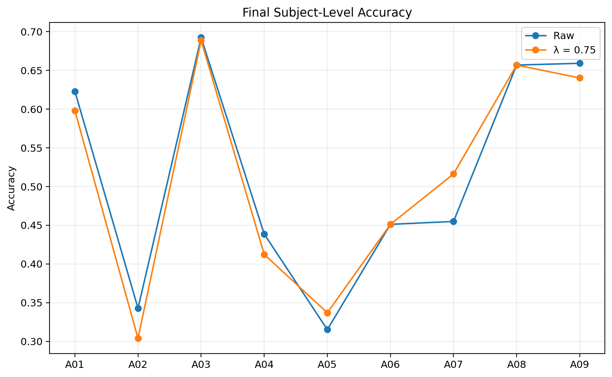
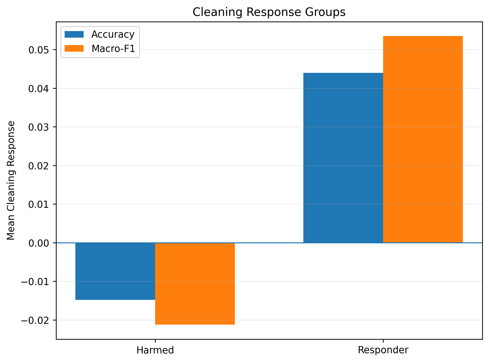
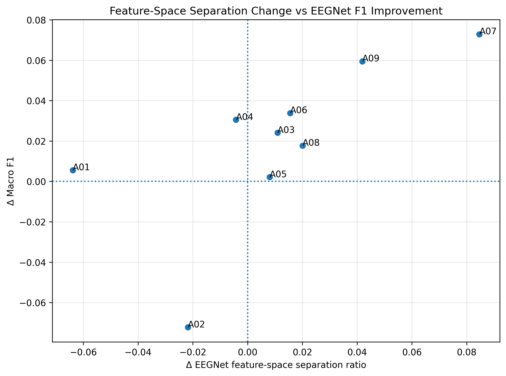
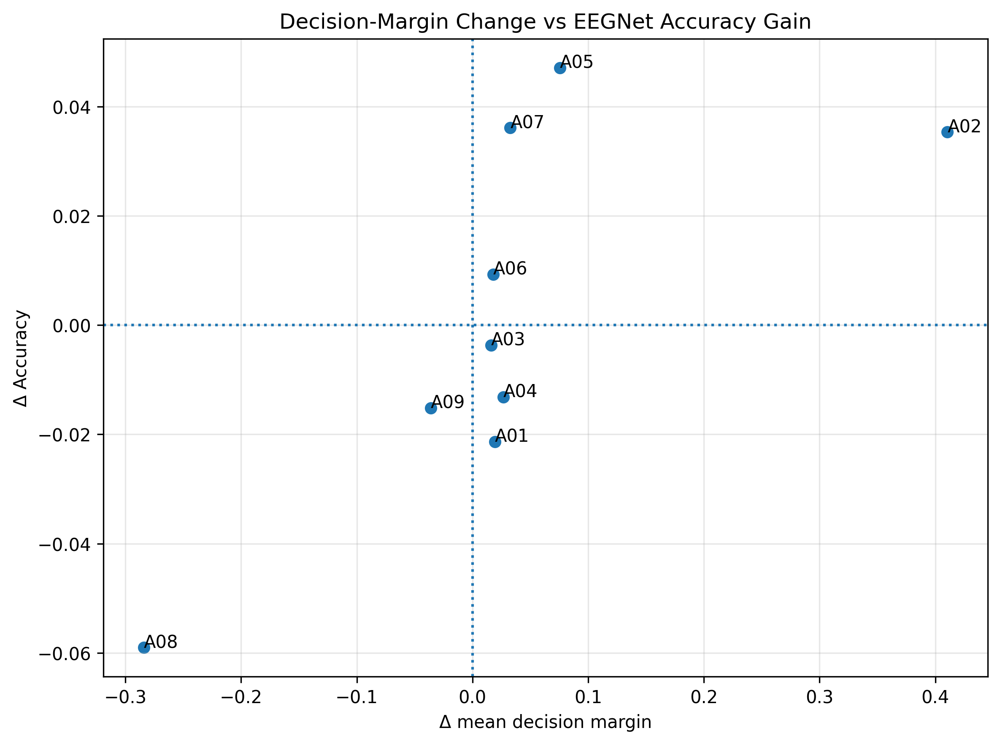
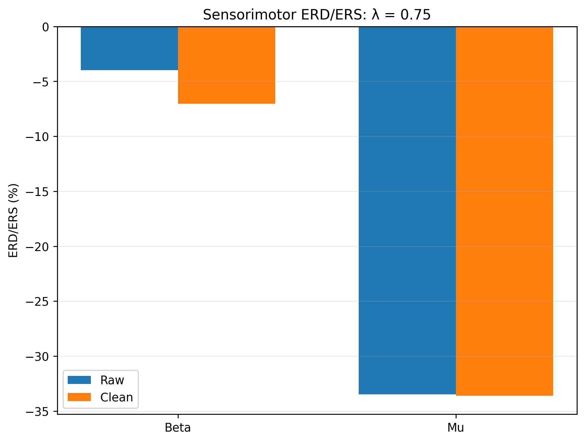

# EEG/EOG Contamination and Motor-Imagery EEG Analysis

This repository contains the complete executed analysis record, result tables, and supporting figures for a study of electrooculography (EOG) contamination in motor-imagery EEG. The project examines how EOG contamination relates to classification error, how it changes during motor imagery, how suppression affects EEGNet classification and sensorimotor signal structure, and why cleaning response varies across subjects.

## Main findings

- The trial-level analysis contains **2,368 matched E-session trials**: 1,247 correct and 1,121 classification errors.
- EOG contamination is associated with classification error at the trial level; the final analysis uses subject-aware statistical modelling to account for repeated observations.
- Across 9 subjects, EOG-to-EEG coupling changes between baseline and motor imagery in a band-dependent way: Theta mean change **-0.0515**, Alpha/Mu **+0.0205**, Beta **+0.0413**, Gamma **+0.0393** in the final corrected R² analysis.
- The final fixed λ = 0.75 validation gives mean raw accuracy **0.514845** versus cleaned accuracy **0.511558**, and mean raw Macro-F1 **0.500805** versus cleaned Macro-F1 **0.504067**. The final validation does **not** establish a significant population-level accuracy improvement from fixed λ = 0.75.
- Cleaning response is heterogeneous across subjects, motivating responder and adaptive-policy analyses. These analyses are exploratory because the subject count is 9.
- Sensorimotor ERD/ERS, beta-band dynamics, motor lateralization, EEGNet feature space, class compactness, and decision margins are used as mechanistic/associational analyses.

### Why the null classification result is informative

The study identifies substantial and structured EOG contamination, yet fixed regression-based suppression at λ = 0.75 does not produce a statistically significant population-level accuracy gain. This means that measurable EOG contamination does not necessarily translate into a corresponding decoding improvement after EEGNet classification. One possible explanation is that EEGNet's temporal convolutions may tolerate some residual EOG-related variance at this suppression strength, although the present analysis does **not** establish that mechanism causally. The subject-level heterogeneity is therefore an important part of the result rather than an incidental detail.

## Main result figures

The README embeds the principal figures for a quick technical review. The image files are committed under `figures/featured/` using GitHub-relative paths; the repository also preserves the **complete detailed figure archive** in `figures/` and the saved numerical analysis outputs in `results/`.

### 1. EOG contamination and classification outcome



Trial-level EOG contamination differs between correctly and incorrectly classified trials; this analysis motivates treating EOG contamination as a measurable predictor of decoding error rather than only as nuisance variance.

### 2. Time-resolved EOG contamination



EOG-to-EEG coupling is temporally dynamic within motor-imagery trials, and the dynamics differ across frequency bands.

### 3. Baseline vs motor-imagery EOG R²



The strongest baseline-to-motor-imagery increases occur in the Alpha/Mu, Beta, and Gamma bands, while Theta decreases in the corrected analysis.

### 4. Final classification validation



The final fixed λ = 0.75 validation shows essentially no population-level accuracy gain from cleaning, with only a small change in Macro-F1.

### 5. Subject-level final accuracy



The subject-level pattern shows heterogeneous responses to the same suppression policy, reinforcing why the population mean should not be treated as a universal subject-level effect.

### 6. Responder heterogeneity



Responder/harmed contrasts are exploratory and should be interpreted in the context of the 9-subject sample.

### 7. EEGNet feature-space analysis



Changes in learned feature-space separation are analysed together with changes in decoding performance. These model-derived measurements are associational, not independent physiological measurements.

### 8. Decision-margin analysis



Subject-level decision-margin changes are strongly associated with classification-performance changes in the analysis. This is a model-derived relationship and should not be interpreted as independent physiological evidence.

### 9. Sensorimotor ERD/ERS



Suppression changes sensorimotor spectral structure, including beta and mu activity at motor-region channels.

## Research question

The central question is not simply whether EOG can be removed. It is whether EOG contamination is structured enough to affect motor-imagery EEG decoding, whether suppression changes physiologically relevant EEG structure, and whether subjects respond differently to the same suppression policy.

## Dataset

The analysis uses BCI Competition IV 2a-style EEG/EOG data with 22 EEG channels and 3 EOG channels, sampled at 250 Hz before the analysis pipeline's downsampling step. The four motor-imagery classes are Left Hand, Right Hand, Feet, and Tongue.

Raw `.mat` files are intentionally excluded from this repository unless redistribution is explicitly permitted by the dataset license.

## Analysis pipeline

### Stage 1 — Data and EOG contamination
1. Load EEG/EOG trials.
2. Filter EEG/EOG.
3. Estimate EOG-to-EEG coupling using regression/R².
4. Evaluate trial-level EOG contamination versus classification error.
5. Analyse within-trial temporal changes in contamination.
6. Compare baseline and motor-imagery contamination.

### Stage 2 — EEGNet classification and suppression
1. Train EEGNet on training data.
2. Keep validation and held-out E-session evaluation separate.
3. Fit EOG regression using training data only.
4. Apply EOG suppression using `EEG_clean = EEG_raw - λ × EOG_component`.
5. Compare raw and cleaned classification.
6. Evaluate multiple λ values.
7. Analyse subject-level responders and adaptive policies.

### Stage 3 — Signal and representation mechanisms
1. Sensorimotor ERD/ERS.
2. Temporal beta dynamics.
3. Normalized beta class contrast.
4. Spatial motor lateralization.
5. Class separability.
6. EEGNet feature-space geometry.
7. Class-specific compactness and confusion.
8. EEGNet decision margins.

### Stage 4 — Final validation
1. Subject-level final comparison.
2. Paired statistical tests.
3. Exact responder permutation testing.
4. Leave-one-subject-out robustness analysis.

## EEGNet implementation

EEGNet is the primary classifier. The training implementation is exposed in `src/eegnet_training.py` so that the architecture and training loop can be inspected directly. Main configuration: **F1=16, D=2, F2=32, dropout=0.5, temporal kernel length=64, batch size=16, Adam learning rate=1e-3, weight decay=1e-4, cosine-annealing learning-rate schedule, maximum 200 epochs, early stopping patience=50, seed=42**.

## Repository structure

```text
eeg-eog-contamination-mi-analysis/
├── notebooks/
│   └── eeg_eog_contamination_analysis.ipynb
├── src/
│   ├── __init__.py
│   ├── config.py
│   └── eegnet_training.py
├── results/
│   └── complete saved analysis CSVs and analysis-specific figures
├── figures/
│   ├── featured/
│   │   └── main README figures
│   └── complete historical/generated figure archive
├── docs/
│   ├── methodology.md
│   └── repository_notes.md
├── README.md
├── requirements.txt
└── .gitignore
```

## Reproducibility

The notebook is the primary analysis record. The CSV files preserve downstream analysis results so that figures and summary tables can be inspected or regenerated without retraining models. The raw EEG/EOG dataset is kept outside the repository. For a new environment, set `BCC_BASE_DIR` to the directory containing `Dataset/`, `results/`, and `images/`.

## Complete figure archive

The `figures/` directory preserves the extensive visual record from the prior repository, including analysis-stage plots, detailed coefficients, λ sweeps, responder/adaptive-policy plots, sensorimotor analyses, feature-space analyses, decision-margin analyses, final validation plots, and additional mapped/unmapped result figures. Redundant files with `(Copy)` in their names are preserved from the previous archive rather than silently discarded.

## Limitations

- The analysis contains 9 subjects, so subject-level responder/adaptive results are exploratory.
- Associations between EOG contamination, physiology, learned representations, and classification performance do not establish causality.
- Model-derived quantities such as decision margins are not independent physiological measurements.
- Different exploratory λ searches should not be conflated with the final fixed-condition validation.

